

### 스마트폰과 연동되는 카트 부착형 스마트 AI 카트

**“카트는 담는 순간 계산하고, 게이트는 나가는 순간 확인한다”**

 

2026 인천대학교 창의공학설계 · 팀 카트라이더

---

## 담는 순간 장바구니에 뜹니다

카트에 부착된 바코드 리더가 상품을 읽으면, 서버를 거쳐 고객 스마트폰 장바구니에 **바로** 반영됩니다.
카트에는 화면이 없습니다. 고객의 스마트폰이 곧 카트의 화면입니다.

  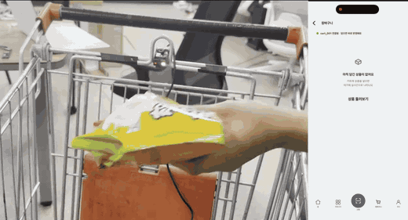
   
  왼쪽 — 카트에 상품을 담는다 · 오른쪽 — 앱 장바구니가 즉시 갱신된다

 

### ▶ [전체 시연 영상 보기 (3분)](https://github.com/CartrAIder/.github/blob/main/profile/media/demo-full.mp4)

문제 제기 → 솔루션 → 아키텍처 → 실물 시연 → 결제까지

---

## 무엇을 푸는가

마트 계산대 앞의 대기줄과, 셀프계산 확산 이후 늘어난 상품 손실을 **함께** 해결합니다.

|  | 문제 | CartrAIder의 답 |
|---|---|---|
| 🕒 | **39%** — 긴 줄 때문에 구매를 포기한 경험이 있는 소비자 | 쇼핑 중에 담으면서 결제까지 끝낸다 |
| 🏃 | **56%** — 계산이 더 빠르다면 매장을 옮길 수 있다는 응답 | 계산대에 서는 절차 자체를 없앤다 |
| 📉 | **약 4%** — 셀프계산 환경의 상품 손실률 | 나가는 길목에서 AI가 결제 내역과 대조한다 |
| 💸 | 기존 스마트카트는 카트 본체에 화면·카메라·배터리를 모두 통합 → 도입비 부담 | **전용 카트 교체 없이** 기존 카트에 부착, 화면은 고객 스마트폰을 쓴다 |

> 선행 사례(이마트 일라이, Caper Cart, Shopic)는 대부분 카트 본체에 기능을 통합해 단가와 유지보수 부담이 큽니다.
> 저희는 애드온 구조를 택하고, 상품 인식은 **바코드 기반으로 단순화**했습니다.
>
> ※ 수치는 발표자료 인용 — 39%·약 4%: 국내 무인계산 관련 보도(매일경제, 2026) / 56%: Digimarc·Forrester, 2018

---

## 두 개의 모듈

<table>
<tr>
<td width="50%" valign="top">

###  카트 모듈 — ESP32
기존 카트에 부착

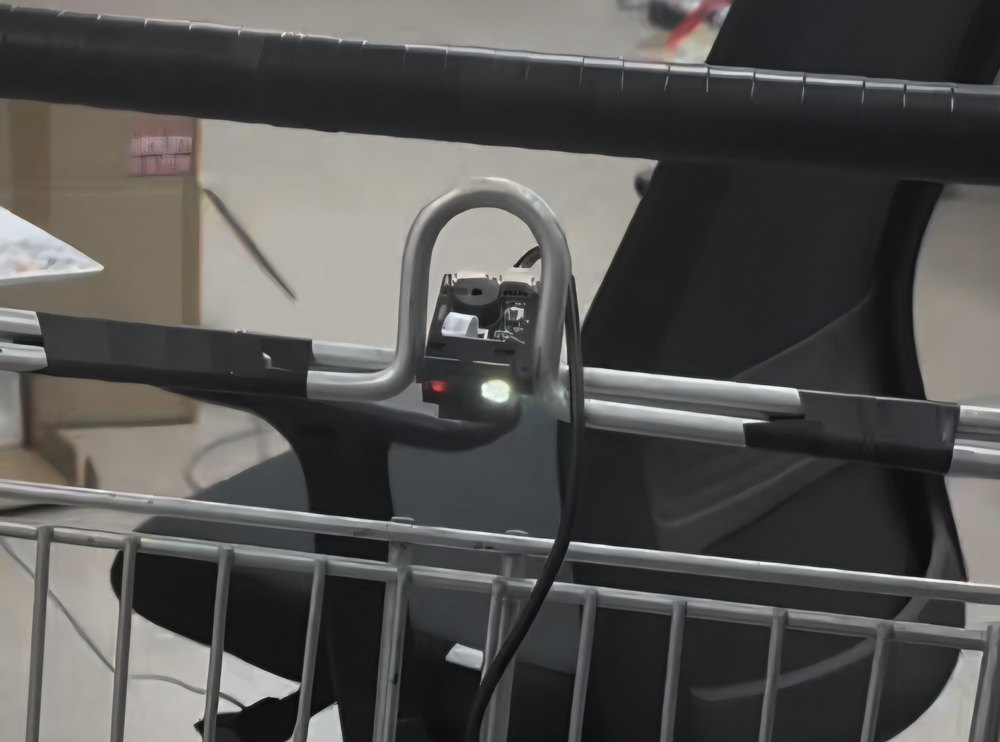

- **바코드 스캔 → 실시간 장바구니** GM65가 상품을 인식하고 MQTT로 서버에 전송, 앱에 즉시 반영
- **바닥선 인식 → 카트 정지** IR 센서가 경계선을 인식하면 서보모터로 바퀴를 잠금

→ *계산대 대기 제거 + 구역 이탈 방지*

</td>
<td width="50%" valign="top">

###  AI 출구 게이트 — Raspberry Pi
매장 출구에 설치

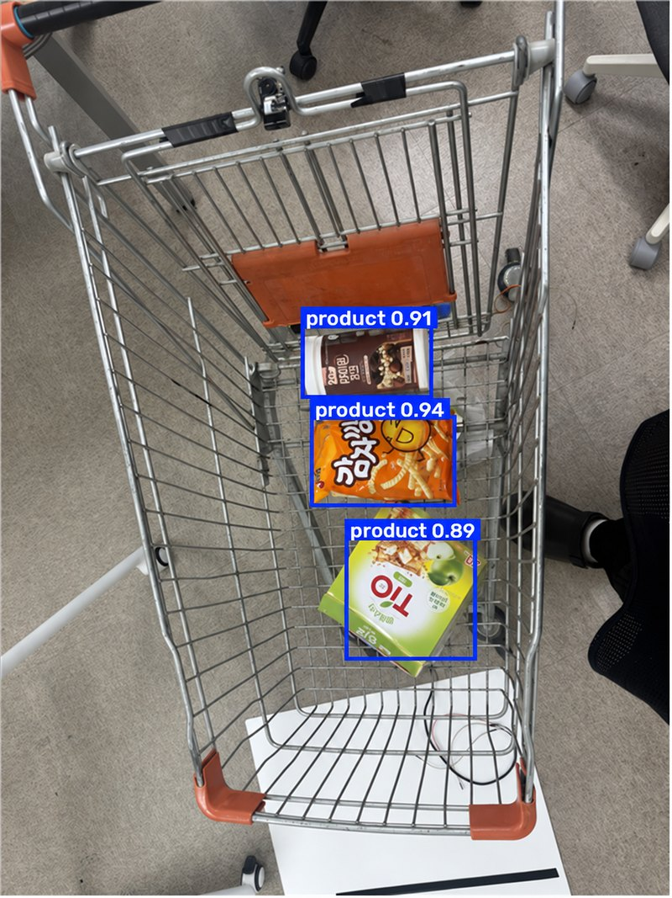

- **카메라 상품 인식** YOLO11s 파인튜닝 모델로 카트 속 상품 인식 (정확도 91%)
- **결제 내역 대조** 인식 결과를 서버의 결제 내역과 비교해 `PASS / REVIEW / FLAG` 판정

→ *스캔 누락 · 미결제 상품 검수*

</td>
</tr>
</table>

---

## 실제로 이렇게 움직입니다

<table>
<tr>
<td width="34%" align="center" valign="top">

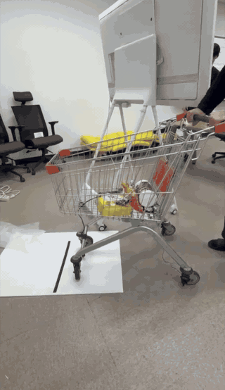

**바닥선 인식 → 정지** 
IR 센서가 경계선을 감지하면 서보가 바퀴를 막는다

</td>
<td width="33%" align="center" valign="top">

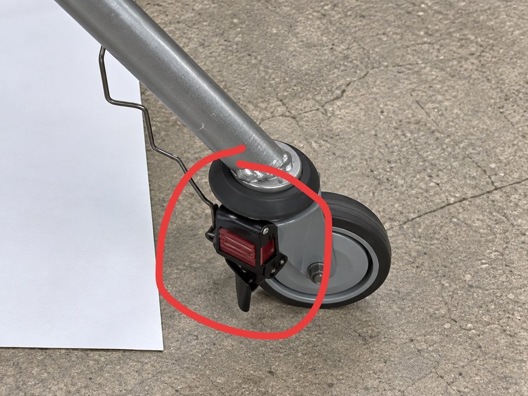

**저가 센서만으로** 
고가 카메라·연산 장치 없이 ESP32 하나로 처리

</td>
<td width="33%" align="center" valign="top">

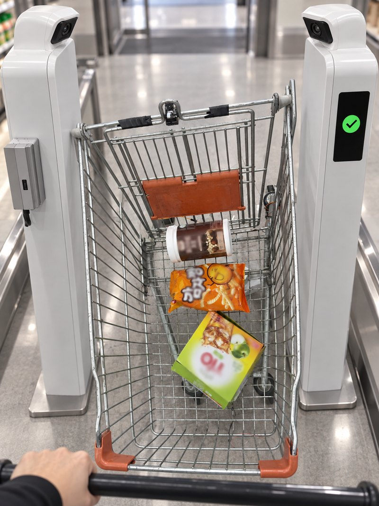

**출구에서 한 번 더** 
카메라가 카트 속 상품을 결제 내역과 대조

</td>
</tr>
</table>

<b>하드웨어 구성 더 보기</b>

 

<table>
<tr>
<td width="50%" align="center">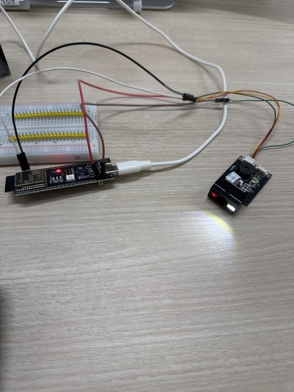 ESP32 + GM65 바코드 리더 · 스캔값을 MQTT로 전송</td>
<td width="50%" align="center">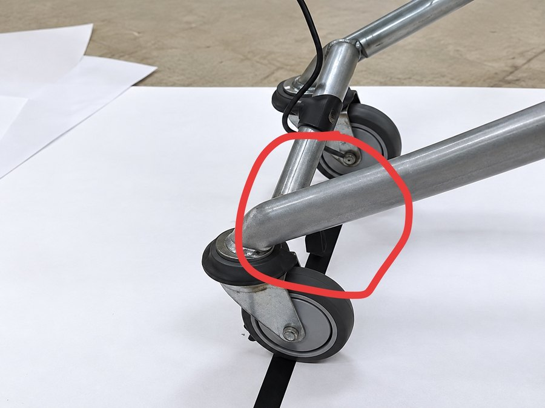 서보모터 브레이크 — 바퀴를 직접 막는다</td>
</tr>
<tr>
<td width="50%" align="center">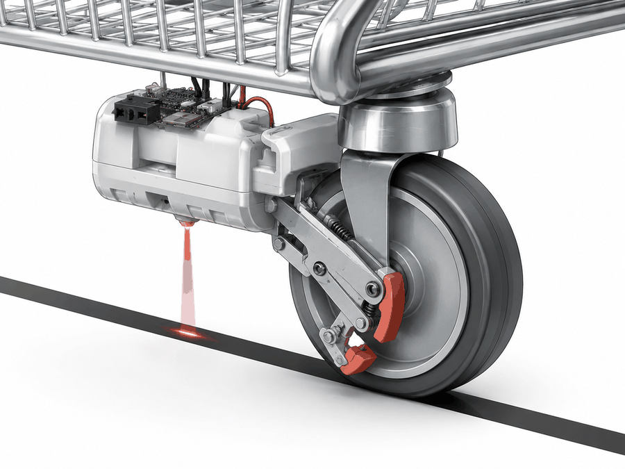 IR 바닥선 감지 → 서보 브레이크 구조</td>
<td width="50%" align="center">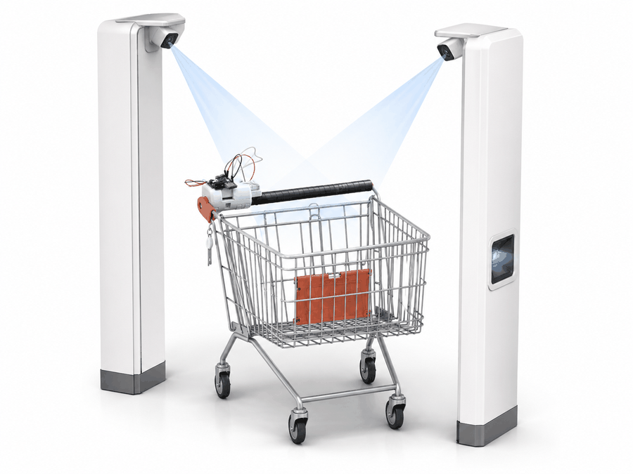 출구 게이트 — 양쪽 상단 대각선 카메라 2대</td>
</tr>
<tr>
<td width="50%" align="center">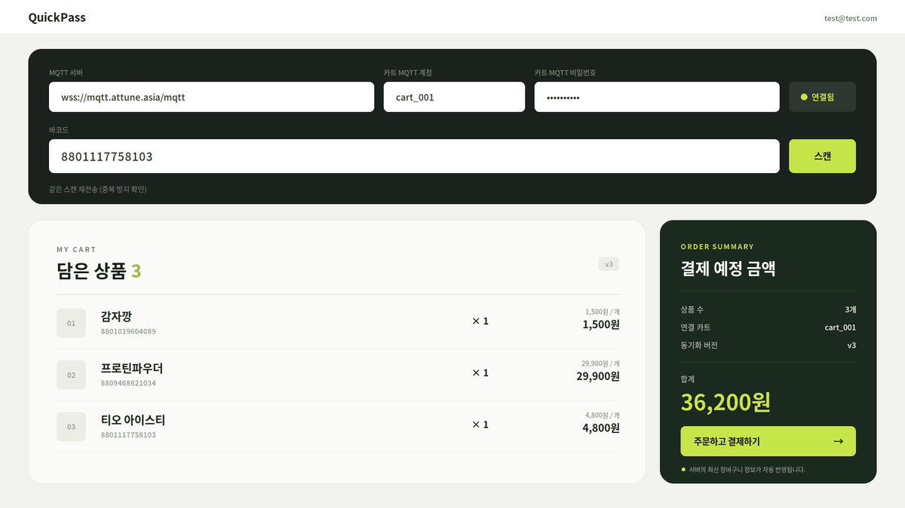 데모용 웹 콘솔 — 카트 MQTT 스캔을 그대로 재현</td>
<td width="50%"></td>
</tr>
</table>

---

## 시스템 아키텍처

  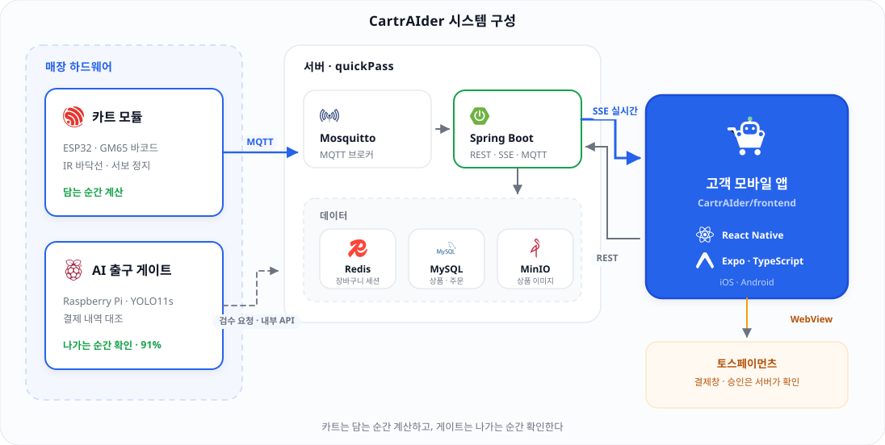

카트는 **MQTT**로 스캔값만 올리고, 앱은 **SSE**로 장바구니 스냅샷을 받습니다.
앱과 카트는 서로를 알지 못하고, 서버(`quickPass`)가 둘을 잇습니다.

| 구간 | 방식 | 내용 |
|---|---|---|
| 카트 → 서버 | **MQTT(S)** | `quickpass/cart/{qrCode}/scan` · 카트마다 별도 계정으로 인증 |
| 서버 → 앱 | **SSE** | 장바구니 전체 스냅샷 푸시 *(WebSocket 미사용)* |
| 앱 → 서버 | **REST** | 카트 연결, 수량 변경·삭제, 주문 생성, 결제 승인 |
| 게이트 ↔ 서버 | **내부 API** | 게이트 토큰으로 검수 시작 → 결제 내역 대조 → 판정 기록 |
| 앱 ↔ 토스 | **WebView** | 결제창. 승인은 서버가 확인 |

<b>배포 구성 (Docker Host)</b>

 

  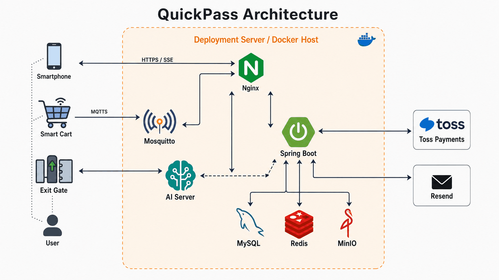

Nginx · Spring Boot · Mosquitto · MySQL · Redis · MinIO를 한 호스트에 Docker Compose로 올리고,
토스페이먼츠(결제)와 Resend(이메일)를 외부 연동으로 씁니다.

### 담는 순간부터 화면에 뜨기까지

  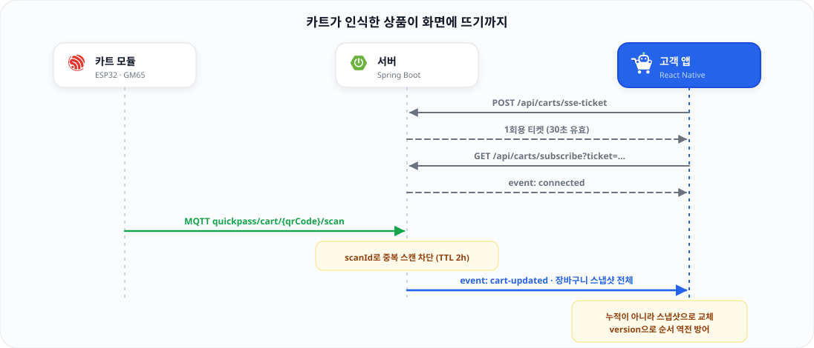

- SSE는 헤더를 실을 수 없어 **1회용 티켓(30초)** 으로 인증합니다.
- 서버는 변경분이 아니라 **장바구니 전체 스냅샷**을 내려주고, 앱은 통째로 교체하되 **버전 번호**로 늦게 도착한 옛 데이터가 최신을 덮어쓰지 않게 막습니다.
- 스캔마다 고유한 `scanId`를 붙여 보내므로, 네트워크 오류로 재전송돼도 **상품이 중복 등록되지 않습니다**.
- 연결이 끊기면 1초 → 2초 → 4초로 늘려가며 새 티켓을 받아 다시 붙습니다.

---

## 화면

### 고객 앱

<table>
<tr>
<td align="center" width="16.6%">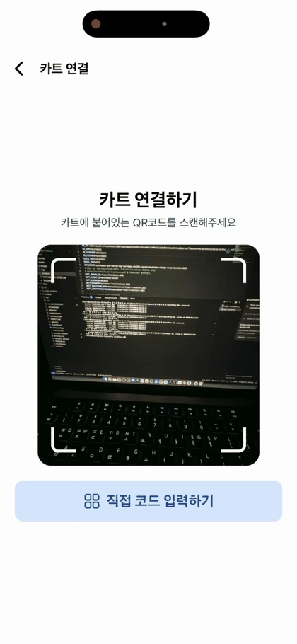</td>
<td align="center" width="16.6%">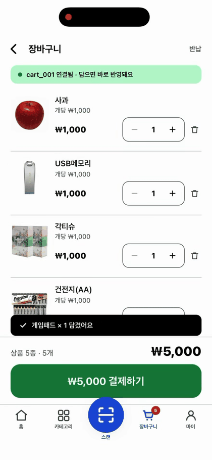</td>
<td align="center" width="16.6%">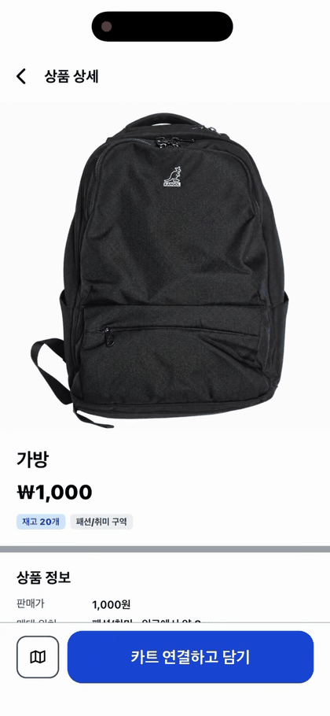</td>
<td align="center" width="16.6%">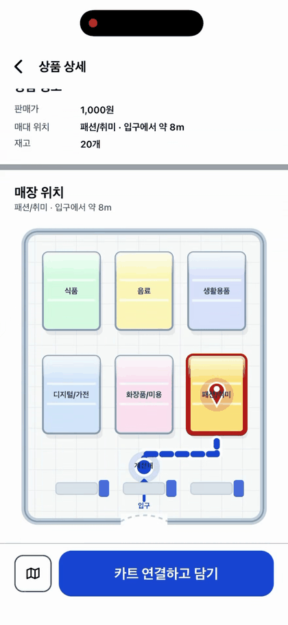</td>
<td align="center" width="16.6%">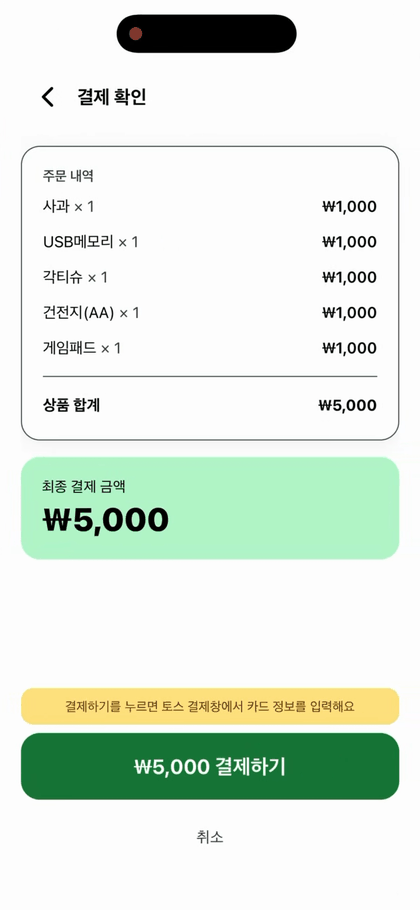</td>
<td align="center" width="16.6%">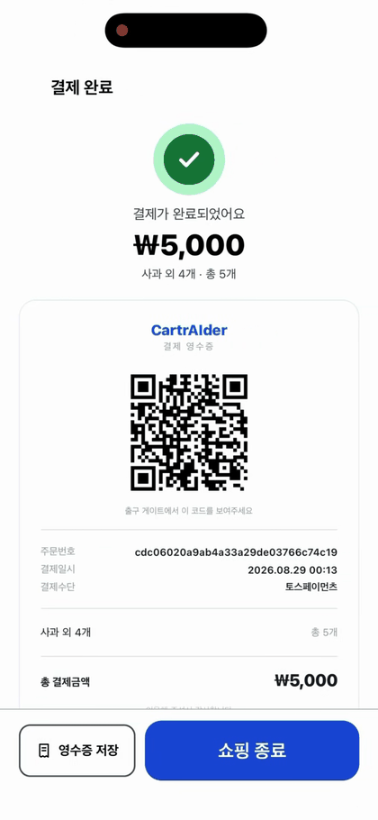</td>
</tr>
<tr>
<td align="center"><b>카트 연결</b> QR 스캔</td>
<td align="center"><b>장바구니</b> SSE 실시간</td>
<td align="center"><b>상품 상세</b> 가격·재고</td>
<td align="center"><b>매대 위치</b> 매장 지도</td>
<td align="center"><b>결제 확인</b> 토스 결제창</td>
<td align="center"><b>결제 완료</b> 출구 QR</td>
</tr>
</table>

### 관리자

<table>
<tr>
<td align="center" width="20%">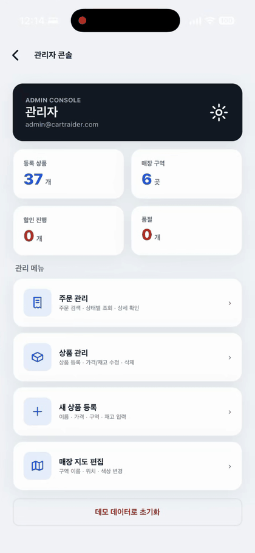</td>
<td align="center" width="20%"></td>
<td align="center" width="20%">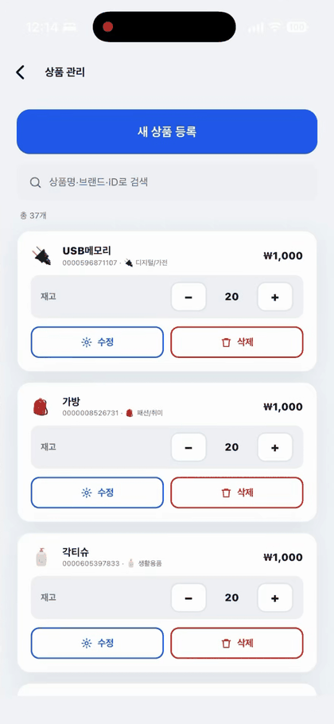</td>
<td align="center" width="20%">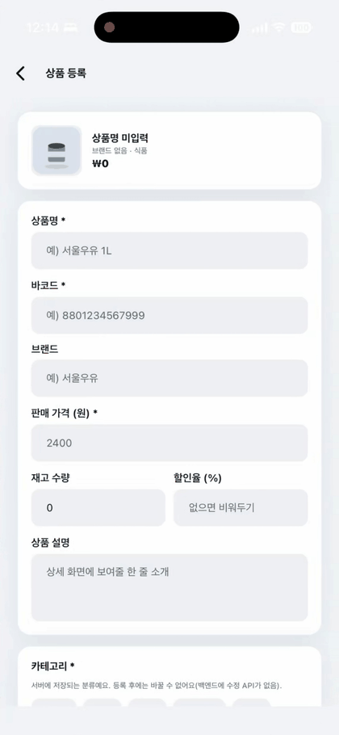</td>
<td align="center" width="20%">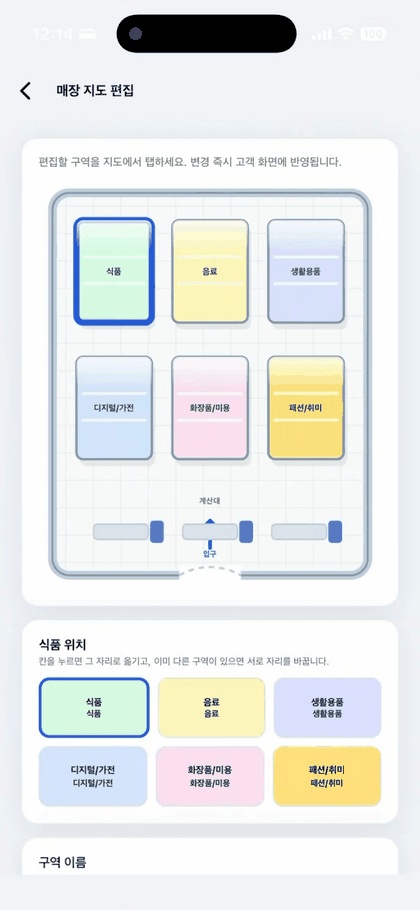</td>
</tr>
<tr>
<td align="center"><b>관리 홈</b></td>
<td align="center"><b>주문 관리</b></td>
<td align="center"><b>상품 관리</b></td>
<td align="center"><b>상품 등록</b></td>
<td align="center"><b>지도 편집</b></td>
</tr>
</table>

> **접근성** — 앱 전체에 *일반인 / 노약자* 두 모드가 있습니다. 기능은 100% 동일하고 화면도 한 벌만 만들되,
> 글자(15→18pt 본문 · 20→30pt 금액), 터치 영역(44→56px), 색 대비(WCAG AA), 상품 그리드(2열→1열),
> 음성 안내가 모드 토큰으로 갈립니다.

---

## 레포지토리

| 레포 | 역할 | 스택 |
|---|---|---|
| [**frontend**](https://github.com/CartrAIder/frontend) | 고객용 모바일 앱 · 관리자 화면 | React Native 0.86 · Expo SDK 57 · TypeScript |
| [**quickPass**](https://github.com/CartrAIder/quickPass) | 백엔드 서버 — 인증·장바구니·주문·결제·게이트 | Spring Boot · MySQL · Redis · MinIO · Mosquitto |
| [**cartAider_ai_server**](https://github.com/CartrAIder/cartAider_ai_server) | 출구 게이트 AI 추론 서버 | Python · YOLO11 · ONNX Runtime |
| **CartGate_AI** *(private)* | 게이트 비전 파이프라인 — 검출·인식·집계 연구 | Python · YOLO11 · DINOv2 + ArcFace |
| [**.github**](https://github.com/CartrAIder/.github) | 조직 공통 설정 — 이 프로필, 코드 컨벤션, 이슈/PR 템플릿 | — |

---

## 기술 스택

| 영역 | 사용 기술 |
|---|---|
| **카트 모듈** | ESP32 · GM65 바코드 리더 · IR 라인 센서 · 서보모터 · MQTT over TLS |
| **AI 게이트** | Raspberry Pi · 카메라 2대 · YOLO11s 파인튜닝(정확도 91%) · ONNX Runtime |
| **서버** | Spring Boot · Spring Security(JWT) · JPA · Spring Integration MQTT · springdoc-openapi |
| **데이터** | MySQL(상품·주문) · Redis(장바구니 세션·게이트 토큰) · MinIO(상품 이미지) |
| **인프라** | Docker Compose · Nginx · Eclipse Mosquitto |
| **앱** | React Native · Expo Router · TypeScript(strict) · Context + useReducer · `react-native-sse` · `react-native-webview` |
| **외부 연동** | 토스페이먼츠(결제) · Resend(이메일 인증) |

---

## 기대효과

|  | 효과 | 근거 |
|---|---|---|
| 01 | **계산대 대기 감소** | 스캔과 결제를 쇼핑 중에 처리해 계산대 앞 반복 절차를 없앰 |
| 02 | **도입비 절감** | 저가 ESP32 모듈을 기존 카트에 부착하고 화면은 스마트폰을 씀 → 소규모 매장까지 도입 가능 |
| 03 | **운영 데이터 관리** | 결제 내역·상품·매장 지도를 관리자 화면에서 통합 관리 |
| 04 | **도난 · 손실 방지** | 바닥선 인식 시 카트 정지 + AI 게이트의 결제 내역 대조 |

---

## 팀

**팀 카트라이더** — 인천대학교 창의공학설계 · 지도교수 컴퓨터공학부 이장호 교수님

김도영 · 김준성 · 박서현 · 박찬혁 · 백수연 · 이현서 · 최수환 · 최지환 · 홍승혁

| 파트 | 담당 |
|---|---|
| 하드웨어 — 카트 모듈 · 출구 게이트 | 전자공학부 파트 |
| AI — 상품 인식 · 검수 파이프라인 | [`cartAider_ai_server`](https://github.com/CartrAIder/cartAider_ai_server) |
| 백엔드 — 서버 · DB · 결제 연동 | [`quickPass`](https://github.com/CartrAIder/quickPass) |
| 프론트엔드 — 앱 · 관리자 화면 | [`frontend`](https://github.com/CartrAIder/frontend) · 최수환, 김도영 |

 

 
<b>담는 순간 계산하고, 나가는 순간 확인하는 카트.</b>
 
2026 창의공학설계 · 팀 카트라이더

